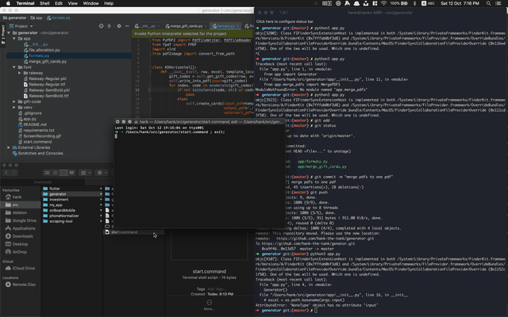

# Introduction 
This is a tool to help [The Good Registry](https://thegoodregistry.com/) to handle bulk orders. First, it was for [Kiwibank](https://www.kiwibank.co.nz/personal-banking/). Now it's used in every large amount orders.

# Demo


# Install Python
1.  Install homebrew
```
$ /usr/bin/ruby -e "$(curl -fsSL https://raw.githubusercontent.com/Homebrew/install/master/install)"
```
2. Install python with homebrew
```
$ brew install python3

# permissions errors
$ sudo chown -R "$USER":admin /usr/local
$ sudo chown -R "$USER":admin /Library/Caches/Homebrew
```
3. check python version
```
python3 -V
```

# Install Virtualenv (Optional)
1. Install pip3
```
$ sudo easy_install pip3
```
2. Install pip3 install virtualenv
```
$ sudo pip3 install virtualenv
```
3. Create a new virtualenv
```
$ virtualenv venv -p python
```
4. Activate virtualenv
```
$ . venv/bin/activate
```


# Install Packages
1.  install poppler
```
$ ruby -e "$(curl -fsSL https://raw.githubusercontent.com/Homebrew/install/master/install)" < /dev/null 2> /dev/null
$ brew install poppler
```
2.  install python packages
```
$ python3 -m pip install -r requirements.txt
```
# Run app
```
$ python3 app.py
```

# Reference
1. [Install Poppler on Mac OSX](http://macappstore.org/poppler/)
2. [FPDF](https://pyfpdf.readthedocs.io/en/latest/)
3. [xlrd](http://www.python-excel.org/)
4. [pdf2image](https://github.com/Belval/pdf2image)
5. [Gooey](https://github.com/chriskiehl/Gooey)
